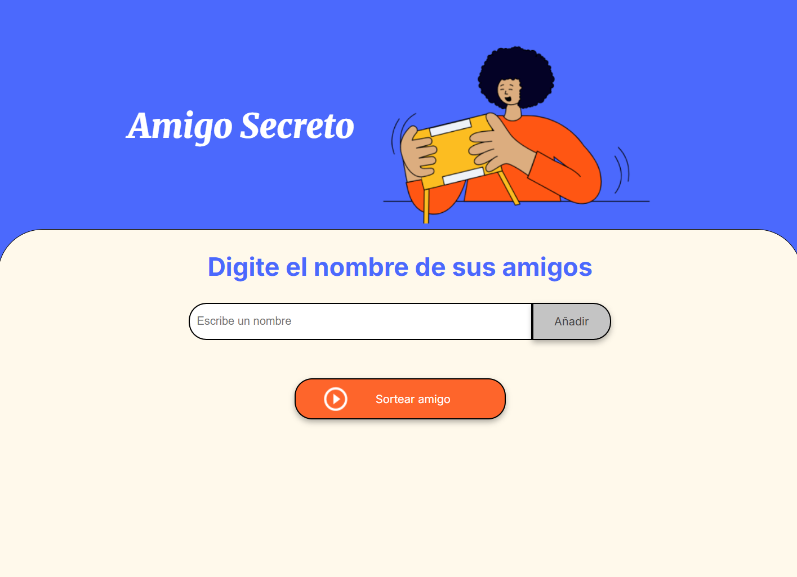

## 🎁 Amigo Secreto — Challenge de Programación

Este proyecto es parte del desafío de lógica de programación de Alura Latam. Consiste en una aplicación web que permite agregar nombres de amigos y realizar un sorteo aleatorio para elegir al "amigo secreto".

🔗 [Repositorio en GitHub](https://github.com/Alice0693/mi-juego-de-programacion)

---

### 📌 Funcionalidades

- Agregar nombres a una lista.
- Visualizar los nombres ingresados.
- Sortear un amigo secreto de forma aleatoria.
- Mostrar el resultado en pantalla.

---

### 🚀 Instalación

1. Clona el repositorio:
   ```bash
   git clone https://github.com/Alice0693/mi-juego-de-programacion.git
   
---

### 🧠 Tecnologías utilizadas

- HTML5  
- CSS3  
- JavaScript (vanilla)

---

### 📂 Estructura del proyecto

mi-juego-de-programacion/ ├── index.html ├── style.css ├── app.js ├── assets/

---

### 🛠️ Cómo usar

1. Escribe el nombre de un amigo en el campo de texto.  
2. Haz clic en “Añadir” para agregarlo a la lista.  
3. Cuando tengas varios nombres, haz clic en “Sortear amigo”.  
4. El resultado se mostrará en pantalla.

---

### 🖼️ Capturas de pantalla

Agrega aquí imágenes que muestren tu proyecto en acción. Puedes subirlas a la carpeta `assets/` y luego enlazarlas así:

  


---

### ⚠️ Posibles problemas

- Si el campo está vacío, se mostrará una alerta.  
- Si no hay nombres en la lista, el sorteo no se ejecutará.

---

### 📄 Licencia

Este proyecto es de uso libre para fines educativos.

---

### 📚 Recursos útiles

Puedes consultar el artículo recomendado en el desafío para mejorar tu README:  
[Cómo escribir un README increíble en tu Github | Alura Cursos Online](https://trello.com/c/sH84XcTW/14-%F0%9F%93%96-readme-%F0%9F%93%96)

